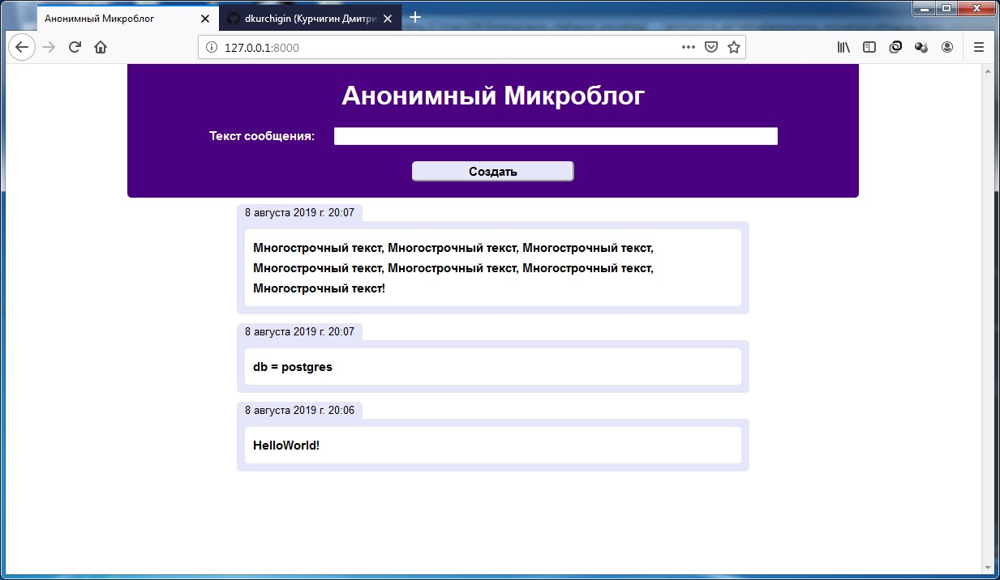

# anon_microblog

Используя Django, реализовать приложение "анонимный микроблог".
Функциональные части

Главная (и единственная) страница, содержит:

- Поле для ввода текста сообщения.

- Кнопка "отправить".

- Список всех предыдущих сообщений.

Регистрация не требуется, чтобы оставить сообщение достаточно зайти на главную страницу.

### Требования:

- Разместить код в репозитории на GitHub.

- Сохранить список зависимостей в requirements.txt.

- В качестве базы данных использовать postgresql или mysql.

- ~~С помощью CSS покрасить весь текст в красный цвет.~~

